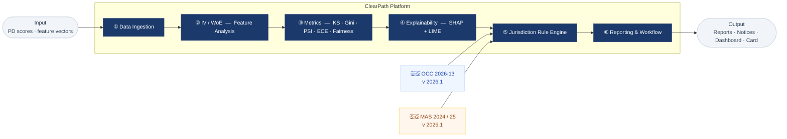

Name: GUO YIHAN

Matriculation Number: G2506255B

Email: GUOY0065@e.ntu.edu.sg

---

# MH6822 Regulatory Technology — Assignment 1

**Designing a Jurisdiction-Aware RegTech Tool**

> **Option B — Architecture Design with Quantitative Demonstration**  
> Regulated entity: **DBS Bank Limited** · Domain: **AI Model Risk Management for Retail Credit Decisioning**  
> Jurisdictions: 🇺🇸 US (OCC Bulletin 2026-13) × 🇸🇬 Singapore (MAS AI MRM 2024 · MAS AI Guidelines 2025 · FEAT Principles · Veritas Toolkit v2.0)

---

## Table of Contents

- [Overview](#overview)
- [Repository Structure](#repository-structure)
- [Task 1 — Selection and Research](#task-1--selection-and-research)
- [Task 2 — Values Audit](#task-2--values-audit)
- [Task 3 — Tool Design](#task-3--tool-design)
- [How to Run](#how-to-run)
- [Dependencies](#dependencies)
- [References](#references)

---

## Overview

This project designs and partially implements a **Jurisdiction-Aware Credit Model Risk Governance Platform** — a RegTech tool that evaluates the same AI-driven credit-scoring model against the US and Singapore regulatory regimes simultaneously, and surfaces the points where those regimes require *different* governance actions from the same institution.

The central argument, drawn from the course lectures: **RegTech tools are political artefacts**. The same model, the same data, the same metrics — but applying US rules where Singapore rules should apply produces confidently wrong compliance assertions. The platform makes this divergence explicit, auditable, and operationally actionable through a versioned jurisdiction rule engine, a standardised metrics suite, and jurisdiction-specific reporting outputs.

**Regulated entity**: DBS Bank Limited (SGX: D05), the largest bank in Southeast Asia by total assets (~SGD 754 billion, FY2024), selected for its documented US presence (FINRA broker-dealer, FDIC resolution-plan filer) and its direct participation in the MAS Veritas Consortium.

---

## Repository Structure

```
├── README.md                              ← This file
│
├── Task1_Selection_Research.pdf           ← Entity selection, domain choice,
│                                             regulatory landscape comparison,
│                                             political divergence analysis
│
├── Task2_Values_Audit.pdf                 ← Mission statement, stakeholder
│                                             perspective, risk vs compliance,
│                                             cost-of-failure analysis
│
├── Task3_Tool_Design_Report.pdf           ← Full tool design: architecture,
│                                             data flows, rule engine, metrics,
│                                             failure analysis, governance card,
│                                             plain-language summary, mgmt pitch
│
├── Task3_Notebook_HW1.ipynb               ← Quantitative implementation
│                                             (13 sections — run end-to-end)
│
├── Task3_Summary_OnePager.pdf             ← One-page plain-language summary
│
├── Task3_Slides_Presentation.pdf          ← Senior management pitch deck
│
└── german_credit_data.csv                 ← Training dataset (UCI/Kaggle)

```

> `german_credit_data.csv` is the Kaggle feature subset of the UCI German Credit dataset (N = 1,000).  
> Original source: [kaggle.com/datasets/uciml/german-credit](https://www.kaggle.com/datasets/uciml/german-credit).

---

## Task 1 — Selection and Research

### Regulated Entity: DBS Bank Limited

DBS satisfies the cross-jurisdictional requirement through its documented US presence:

- Los Angeles representative office
- Broker-dealer operations via DBS Securities (USA) LLC (FINRA-regulated)
- Resolution-plan filings with the Federal Reserve and FDIC ([FDIC filing, 2024](https://www.fdic.gov/system/files/2024-07/dbs-165-1312.pdf))

DBS is simultaneously subject to US federal oversight (OCC model risk expectations, Federal Reserve FBO supervision, CFPB consumer compliance) and MAS supervision in Singapore. Its direct participation in the **Veritas Consortium** — the MAS-sponsored initiative that produced the FEAT fairness assessment methodology used in this project — makes it the most credible anchor for a tool claiming to implement MAS's AI governance framework.

### Domain: AI Model Risk Management for Retail Credit Decisioning

Credit decisioning is selected because it is: (a) high-stakes — model outputs determine access to financial services; (b) subject to the most demanding explainability standards in MAS 2024; (c) covered by explicit adverse action notice requirements in both jurisdictions; and (d) well-supported by an established validation toolkit (KS, Gini, PSI, SHAP, IV/WoE, fairness metrics) that both regulators expect to see documented.

### Key Regulatory Divergences

| Dimension | 🇺🇸 US — OCC 2026-13 | 🇸🇬 SG — MAS 2024 / 2025 |
|:---|:---|:---|
| **GenAI coverage** | Explicitly **excluded** — separate RFI forthcoming | **Included** — all AI, including GenAI agents |
| **Local XAI** | Not mandated | **Required** for adverse credit decisions (MAS 2024, p. 14) |
| **Fairness standard** | ECOA / Reg B — enumerated classes; EEOC 4/5ths rule (DI ≥ 0.80) | MAS FEAT — outcome-based monitoring; no fixed DI threshold |
| **PSI retrain threshold** | 0.25 (SR 11-7 lineage) | **0.20** — more conservative; lifecycle emphasis |
| **Independent validation** | De-emphasised (quality over structure) | Required for high-risk AI |
| **Min Gini** | ≥ 0.35 | ≥ 0.30 (proportionality principle) |
| **Feature documentation** | Implied via conceptual soundness | Explicit per-feature justification required (MAS 2024, p. 14) |
| **Adverse action format** | CFPB Reg B §1002.9 — specific written reasons, 30 days | MAS FEAT + PDPA Advisory Guidelines — meaningful explanation |

The most consequential divergence is the **PSI threshold asymmetry**: at PSI ∈ [0.20, 0.25], the same model simultaneously requires retrain review in Singapore and warrants only monitoring in the US. The platform flags this as a jurisdiction divergence event rather than silently resolving it.

---

## Task 2 — Values Audit

### Company mission

ClearPath RegTech Pte. Ltd. — a Singapore-incorporated B2B software provider at early-growth stage (~25–40 staff). Core competence: **regulatory translation** — encoding primary regulatory guidance into versioned, operational configuration objects that financial institutions run against their own model outputs.

### Whose perspective does the tool serve?

Primarily the **second-line risk and compliance function** — model risk management teams and CCOs. These stakeholders have budget authority, governance mandate, and the power to require remediation from first-line model owners.

The tool is also designed to protect **consumer interests** beyond what many paying clients would request: local SHAP explanations (not mandated in the US) and dual-attribute fairness monitoring are included because they improve substantive risk detection, not because they produce clean dashboards. The tension between bank efficiency, regulatory robustness, and consumer protection is acknowledged explicitly rather than resolved quietly.

### Genuine risk measurement vs documentation compliance

**Included because it improves risk detection (not required by name in either regulation):**

- **PSI monitoring** — surfaces early-warning drift signals between annual validation cycles, using jurisdiction-specific retrain thresholds rather than a single arbitrary number
- **IV / WoE analysis** on raw features — provides numeric, auditable justification for each model variable; directly responsive to MAS 2024's explicit per-feature requirement

**Excluded because it would serve documentation over substance:**

- Uniform automated sign-off workflow — generates voluminous records without discriminating between a low-risk and a high-risk model; replaced with risk-tiered routing based on model materiality

### Who bears the cost if the tool gets it wrong?

| Failure mode | Primary cost-bearer | Specific harm |
|:---|:---|:---|
| False negative (missed risk) | Consumers + Bank | Borrowers assessed by degraded model without detection |
| False positive (over-alerting) | Business lines | Alert fatigue masks real risks; deployment delays |
| Fairness mismeasurement | Protected groups | Discriminatory patterns concealed from examiner and consumer |
| **Jurisdictional misconfiguration** | All stakeholders | Produces confidently wrong compliance assertions — the most dangerous failure mode |

---

## Task 3 — Tool Design

### Six-Layer Architecture



Each jurisdiction is a **versioned configuration object** (`JurisdictionConfig`) — not hard-coded logic. Updating a regulatory parameter requires only a config change; the assessment engine is unchanged. Historical reports remain valid because each is stamped with the active config version and effective date.

**Three explicit human judgement gates** (the assignment brief notes that "judgement cannot be outsourced"):

1. **Materiality classification** — a human risk officer confirms the model's risk tier before governance routing proceeds
2. **Warning-zone escalation** — platform generates a recommendation; human reviewer decides whether to escalate
3. **Adverse action review** — auto-drafted notices reviewed by a compliance officer before issuance

### What the Platform Does NOT Do

Stated explicitly because honest scoping is itself a governance requirement:

- Does **not** make credit decisions
- Does **not** incorporate macroeconomic stress scenarios
- Does **not** cover Basel III capital model validation
- Does **not** implement OSFI E-23 (Canada) or the EU AI Act
- Does **not** handle real-time scoring — batch inference only
- Does **not** govern GenAI under the US regime, consistent with OCC 2026-13's explicit exclusion
- Does **not** replace human judgement at the three gates above

### Notebook Sections

`Task3_Notebook_HW1.ipynb` — 13 sections, run sequentially:

| # | Section | Key output |
|:---|:---|:---|
| 1 | Setup & Imports | Environment validation (SHAP, fairlearn, LIME, LightGBM) |
| 2 | Data Loading & Label Construction | Synthetic labels: seed = 42, 70/30 split, Basel II EL weights |
| 3 | IV / WoE Analysis | Per-feature predictive power; regulatory feature justification audit |
| 4 | Preprocessing & Multi-Model Training | LR, RF, GBM, LightGBM — stratified 5-fold CV comparison |
| 5 | Extended Metrics | PR-AUC curves, Lift@30%, ECE bar chart, calibration curve |
| 6 | Fairness Analysis | Sex + Age groups; DI, DPD, EOD; US 4/5ths rule + MAS FEAT |
| 7 | PSI Drift Monitor | Percentile-bin PSI Q1–Q6; jurisdiction divergence zone highlighted |
| 8 | Explainability: SHAP + LIME | Global summary; local per-applicant waterfall; LIME independent check |
| 9 | Jurisdiction Rule Engine | `JurisdictionConfig` registry — US and SG versioned configs |
| 10 | Assessment Engine | `assess()` — PASS / WARN / ESCALATE per check, per jurisdiction |
| 11 | Compliance Dashboard | 5-panel executive view → `compliance_dashboard.png` |
| 12 | Adverse Action Notices | CFPB Reg B format (US) vs MAS FEAT / PDPA format (SG) |
| 13 | Model Governance Card | Full JSON governance card with failure modes and limitations |

### Compliance Dashboard


*Panel A: Performance vs US / SG thresholds · Panel B: Fairness by Sex · Panel C: PSI drift with jurisdiction divergence zone · Panel D: Decision matrix (US × SG) · Panel E: Divergence heatmap*

### Quantitative Results

**Dataset**: German Credit (UCI / Kaggle, N = 1,000). Synthetic labels constructed using a feature-weighted scoring function calibrated to a 70/30 good/bad split, grounded in Basel II expected-loss theory. Seed = 42, fixed and logged for reproducibility.

| Metric | Value | US threshold | SG threshold |
|:---|:---:|:---:|:---:|
| ROC-AUC | 0.9175 | ≥ 0.68 ✅ | ≥ 0.65 ✅ |
| Gini | 0.8350 | ≥ 0.35 ✅ | ≥ 0.30 ✅ |
| KS statistic | 0.6933 | ≥ 0.25 ✅ | ≥ 0.20 ✅ |
| Brier Score | 0.1108 | ≤ 0.22 ✅ | ≤ 0.25 ✅ |
| PR-AUC | 0.8611 | supplementary | supplementary |
| ECE | 0.0815 | < 0.05 ideal | < 0.05 ideal |
| Sex DI (female / male) | 1.13 | ≥ 0.80 ✅ | outcome review ✅ |
| **PSI at Q2** | **~0.22** | **≤ 0.25 → Monitor** | **≥ 0.20 → Retrain ⚡** |

The Q2 PSI result is the quantitative centrepiece: the same model, the same drift measurement, simultaneously compliant in the US and requiring retrain review in Singapore — the jurisdiction divergence the platform is built to surface.

---

## How to Run

**1. Clone the repository**

```bash
git clone https://github.com/[your-username]/[your-repo].git
cd [your-repo]
```

**2. Install dependencies**

```bash
pip install -r requirements.txt
```

**3. Confirm the dataset**

`german_credit_data.csv` should be in the working directory. If absent, download from [Kaggle](https://www.kaggle.com/datasets/uciml/german-credit) and place it there.

**4. Run the notebook**

Open `Task3_Notebook_HW1.ipynb` in Jupyter Lab, Jupyter Notebook, or Google Colab and run all cells sequentially. All outputs — metrics, figures, governance card, adverse action notices, and `compliance_dashboard.png` — are generated automatically.

> **Google Colab**: Cell 1 installs any missing packages automatically. Upload `german_credit_data.csv` to the Colab session storage before running.

---

## Dependencies

```
python       >= 3.10
scikit-learn >= 1.3
lightgbm     >= 4.0
shap         >= 0.44
lime         >= 0.2
fairlearn    >= 0.10
pandas       >= 2.0
numpy        >= 1.24
matplotlib   >= 3.7
seaborn      >= 0.12
```

A `requirements.txt` is included for one-command installation.

---

## Task 4

Per the assignment brief, Task 4 (10%) consists of questions tailored to this submission, to be answered after submission. Every design choice in the tool, the notebook, and the report carries a named rationale and a regulatory anchor; every limitation is stated explicitly in the model governance card (Notebook Section 13) and the full tool design report.

---

## Data Note

The prototype uses the **German Credit Dataset** as an open, reproducible benchmark. In production, this platform would ingest Singapore Credit Bureau (CBS) scores, DBS internal behaviour scores, and MAS Financial Stability Review macro stress scenarios. DBS realism is injected through: (a) bad-rate calibration consistent with DBS's disclosed retail NPL profile; (b) direct regulatory mapping to MAS / PDPA / FEAT and OCC 2026-13; (c) the Veritas Toolkit v2.0 FEAT methodology adopted by DBS.

---

## References

**Regulatory**

- OCC Bulletin 2026-13 (17 Apr 2026): <https://www.occ.treas.gov/news-issuances/bulletins/2026/bulletin-2026-13.html>
- MAS AI MRM Information Paper (Dec 2024): <https://www.mas.gov.sg/publications/monographs-or-information-paper/2024/artificial-intelligence-model-risk-management>
- MAS AI Guidelines Consultation Paper (Nov 2025): <https://www.mas.gov.sg/news/media-releases/2025/mas-guidelines-for-artificial-intelligence-risk-management>
- MAS FEAT Principles (2018): <https://www.mas.gov.sg/news/media-releases/2018/mas-and-abs-launch-principles-for-fair-responsible-and-transparent-use-of-ai>
- Veritas Toolkit v2.0: <https://github.com/veritas-toolkit>
- CFPB Reg B AI Adverse Action Guidance: <https://www.consumerfinance.gov/about-us/newsroom/cfpb-issues-guidance-on-credit-denials-by-lenders-using-artificial-intelligence/>
- CFPB Reg B Final Rule (Apr 2026): <https://www.consumerfinancialserviceslawmonitor.com/2026/04/cfpb-finalizes-regulation-b-subpart-a-rule-largely-as-proposed/>
- FDIC DBS Resolution Plan (2024): <https://www.fdic.gov/system/files/2024-07/dbs-165-1312.pdf>

**Academic and technical**

- Lundberg & Lee (2017). A Unified Approach to Interpreting Model Predictions. *NeurIPS*. <https://arxiv.org/abs/1705.07874>
- Ribeiro, Singh & Guestrin (2016). "Why Should I Trust You?" — Explaining Any Classifier. *KDD*. <https://arxiv.org/abs/1602.04938>
- Hardt, Price & Srebro (2016). Equality of Opportunity in Supervised Learning. *NeurIPS*.
- Barocas, Hardt & Narayanan (2023). *Fairness and Machine Learning*. MIT Press. <https://fairmlbook.org>
- Siddiqi, N. (2012). *Credit Risk Scorecards*. Wiley.
- arXiv (2025). Information-Theoretic Framework for WoE / IV as KL Divergence. <https://arxiv.org/html/2408.03497v3>
- PMC (2024). Credit Scoring Transparency via LightGBM + SHAP. <https://pmc.ncbi.nlm.nih.gov/articles/PMC11318906/>
- Yurdakul, B. (2018). Statistical Properties of Population Stability Index.

---

*MH6822 Regulatory Technology — NTU, May 2026*
